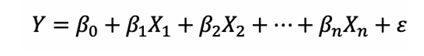

******* Kindly note that the notes in this file are not mine. I have put them in here as reference since they are important ********

research paper 1: [linear regression p1.pdf](linear%20regression%20p1.pdf)

Correlation:
 refers to a statistical measure 
 that describes the extent to which two variables are linearly related,
 meaning they tend to change together at a constant rate

https://www.jmp.com/en/statistics-knowledge-portal/what-is-correlation

Multicollinearity:
 is a statistical concept where several independent variables in a model are correlated.
 Two variables are considered perfectly collinear if their correlation coefficient is +/- 1.0.

https://online.stat.psu.edu/stat462/node/177/

  where β0 is the intercept, β1 to βn is the regression coefficient, X1 to Xn is the independent 
variable, and ε is the error term.

 2.2 Assumptions of linear regression
 In order to ensure the validity of the linear regression model and the properties of the best 
linear unbiased estimator (BLUE), the following assumptions need to be met:
  Linear relationship: There is a linear relationship between independent variables and 
dependent variables.
  Independence: The sample observations are independent of each other.
  Homoscedasticity: The error term has the same variance (σ²) for all independent 
variable levels.
  Normality: The error terms are normally distributed.
  No multicollinearity: there is no complete or highly linear relationship between the 
independent variables.

In linear regression, 
residuals represent the difference between the actual observed value of the dependent variable and the value predicted by the regression model.
Residual = actual y value − predicted y value , r i = y i − y i ^ . Having a negative residual means that the predicted value is too high, similarly
if you have a positive residual it means that the predicted value was too low. The aim of a regression line is to minimise the sum of residuals.

https://www.ncl.ac.uk/webtemplate/ask-assets/external/maths-resources/statistics/regression-and-correlation/residuals.html#:~:text=%E2%88%92%5Eyi.-,Residual%20%3D%20actual%20y%20value%20%E2%88%92%20predicted%20y%20value%20%2C%20r%20i,minimise%20the%20sum%20of%20residuals.

learn more here if my code on how to be stepwise through your coding for linear regression is not clear
https://articles.outlier.org/simple-regression-analysis